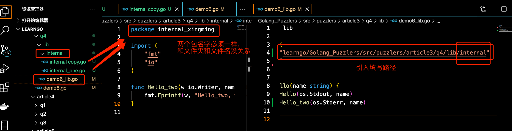
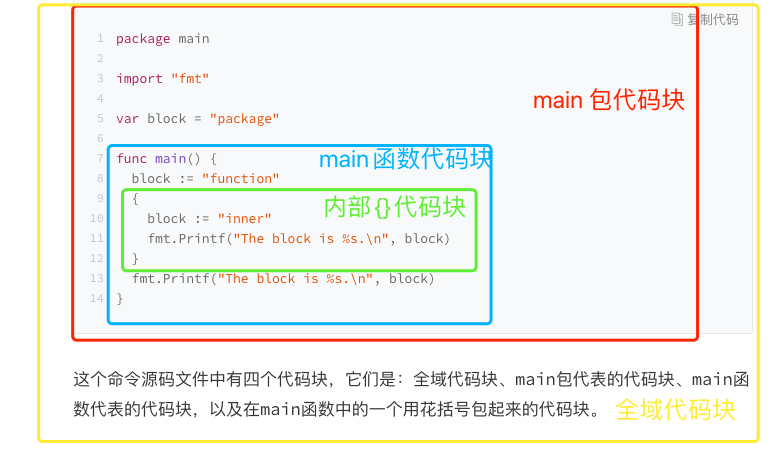
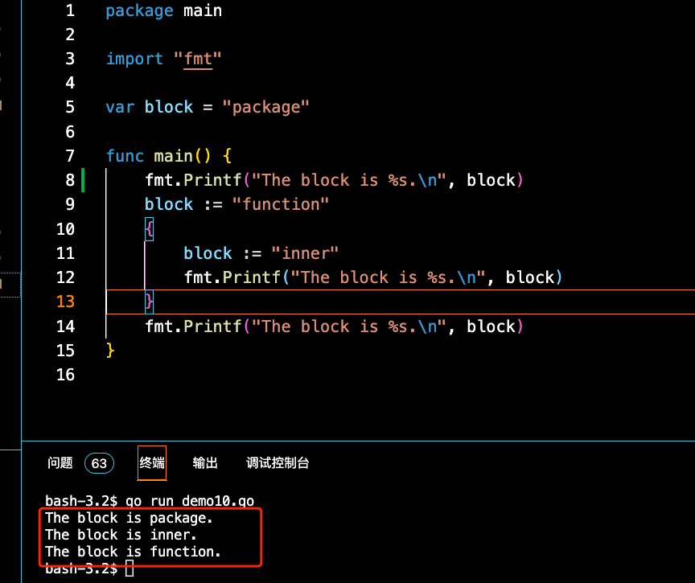

#  Go 语言中的程序实体（29109-）

是变量、常量、函数、结构体和接口的统称

规则：我们总是会先声明（或者说定义）程序实体，然后再去使用。

比如在上一篇的例子中，我们先定义了变量name，然后在main函数中调用fmt.Printf函数的时候用到了它。

## 标识符

---

再多说一点，程序实体的名字被统称为标识符

+++


* 标识符可以是任何 Unicode 编码可以表示的字母字符、数字以及下划线“_”，但是其首字母不能是数字。

+  从规则上说，我们可以用中文作为变量的名字。但是，我觉得这种命名方式非常不好，自己也会在开发团队中明令禁止这种做法。作为一名合格的程序员，我们应该向着编写国际水准的程序无限逼近。


> 在同一个目录下  的源码文件都.  需要被声明为属于 同一个代码包。

> ：源码文件声明的包名可以与其所在目录的名称不同，只要这些文件声明的包名一致就可以。


名称的首字母为大写的程序实体才可以被当前包外的代码引用，否则它就只能被当前包内的其他代码引用。

---


+++


通过名称，Go 语言自然地把程序实体的访问权限划分为了包级私有的和公开的。对于包级私有的程序实体，即使你导入了它所在的代码包也无法引用到它。~~

对于程序实体，还有其他的访问权限规则吗？答案是肯定的。

5. 

   ####  在 Go 1.5 及后续版本中，我们可以通过创建internal代码包让一些程序实体仅仅能被当前模块中的其他代码引用。

   ####  这被称为 Go 程序实体的第三种访问权限：模块级私有。

   

   具体规则是，internal代码包中声明的公开程序实体仅能被该代码包的直接父包及其子包中的代码引用。

   

   当然，引用前需要先导入这个internal包。对于其他代码包，导入该internal包都是非法的，无法通过编译。“Golang_Puzzlers”项目的puzzlers/article3/q4包中有一个简单的示例，可供你查看。你可以改动其中的代码并体会internal包的作用。

   




## 程序实体复习

-- 还记得吗？Go 语言中的程序实体包括变量、常量、函数、结构体和接口。

 Go 语言是静态类型的编程语言，所以我们在声明变量或常量的时候，都需要指定它们的类型，或者给予足够的信息，这样才可以让 Go 语言能够推导出它们的类型。

```html
在 Go 语言中，变量的类型可以是其预定义的那些类型，也可以是程序自定义的函数、结构体或接口。常量的合法类型不多，只能是那些 Go 语言预定义的基本类型。它的声明方式也更简单一些
```


## 语法糖（Syntactic sugar），

也译为糖衣语法，是由英国计算机科学家彼得·约翰·兰达（Peter J. Landin）发明的一个术语，指计算机语言中添加的某种语法，这种语法对语言的功能并没有影响，但是更方便程序员使用。通常来说使用语法糖能够增加程序的可读性，从而减少程序代码出错的机会


：=才是语法糖，var xxx = 5 才是正宫。

在编写if、for或switch语句的时候，我们经常把它安插在初始化子句中，并用来声明一些临时的变量。而相比之下，var 方式更加通用，它可以被用在任何地方。


**在你改变getTheFlag函数的结果类型之后，Go 语言的编译器会在你再次构建该程序的时候，自动地更新变量name的类型。**

go语言依旧是静态编程语言，两者的区别在于： 1】动态语言是运行时确定变量类型 2】静态语言是编译时确定变量类型

## 代码块

在 Go 语言中，代码块一般就是一个由花括号括起来的区域，里面可以包含表达式和语句。Go 语言本身以及我们编写的代码共同形成了一个非常大的代码块，也叫全域代码块。


这主要体现在，只要是公开的全局变量，都可以被任何代码所使用。

相对小一些的代码块是代码包，一个代码包可以包含许多子代码包，所以这样的代码块也可以很大

。接下来，每个源码文件也都是一个代码块，每个函数也是一个代码块，每个if语句、for语句、switch语句和select语句都是一个代码块。

甚至，switch或select语句中的case子句也都是独立的代码块。

走个极端，我就在main函数中写一对紧挨着的花括号算不算一个代码块？当然也算，这甚至还有个名词，叫“空代码块”。


## 变量重新声明

回到变量重声明的问题上。其含义是对已经声明过的变量再次声明。

变量重声明的前提条件如下。

1、由于变量的类型在其初始化时就已经确定了，所以对它再次声明时赋予的类型必须与其原本的类型相同，否则会产生编译错误。

2、变量的重声明只可能发生在某一个代码块中。如果与当前的变量重名的是外层代码块中的变量，那么就是另外一种含义了，我在下一篇文章中会讲到。

3、变量的重声明只有在使用短变量声明时才会发生，否则也无法通过编译。

4、如果要在此处声明全新的变量，那么就应该使用包含关键字var的声明语句，但是这时就不能与同一个代码块中的任何变量有重名了。被“声明并赋值”的变量必须是多个，并且其中至少有一个是新的变量。这时我们才可以说对其中的旧变量进行了重声明。


本次的思考题只有一个：如果与当前的变量重名的是外层代码块中的变量，那么这意味着什么？


**当前的变量覆盖外层变量**

## 程序实体访问权限

程序实体的访问权限有三种：包级私有的、模块级私有的和公开的


一个程序实体的作用域总是会被限制在某个代码块中，而这个作用域最大的用处，就是对程序实体的访问权限的控制





初看这道题，你可能会认为它无法通过编译，因为三处代码都声明了相同名称的变量。

> 的确，声明重名的变量是无法通过编译的，用短变量声明对已有变量进行重声明除外，但这只是对于同一个代码块而言的。

**即：对于同一个代码块，声明重名的变量是无法通过编译的，用短变量声明对已有变量进行重声明除外**


这个查找过程不只针对于变量，还适用于任何程序实体。如下面所示。

1. 首先，代码引用变量的时候总会最优先查找当前代码块中的那个变量。注意，这里的“当前代码块”仅仅是引用变量的代码所在的那个代码块，并不包含任何子代码块。

2. 其次，如果当前代码块中没有声明以此为名的变量，那么程序会沿着代码块的嵌套关系，从直接包含当前代码块的那个代码块开始，一层一层地查找。

3. 一般情况下，程序会一直查到当前代码包代表的代码块。如果仍然找不到，那么 Go 语言的编译器就会报错了。

4. 还记得吗？如果我们在当前源码文件中导入了其他代码包，那么引用其中的程序实体时，是需要以限定符为前缀的。所以程序在找代表变量未加限定符的名字（即标识符）的时候，是不会去被导入的代码包中查找的。

   

   

   ```但有个特殊情况，如果我们把代码包导入语句写成import . "XXX"的形式（注意中间的那个“.”），那么就会让这个“XXX”包中公开的程序实体，被当前源码文件中的代码，视为当前代码包中的程序实体。```

   

   ``` 比如，如果有代码包导入语句import . fmt，那么我们在当前源码文件中引用fmt.Printf函数的时候直接用Printf就可以了。在这个特殊情况下，程序在查找当前源码文件后会先去查用这种方式导入的那些代码包。```

   

   为了方便描述，我就把不同代码块中的重名变量叫做“可重名变量”(已经是不同的变量了)吧。

   注意，在同一个代码块中不允许出现重名的变量，这违背了 Go 语言的语法。关于这两者的表象和机理，我们已经讨论得足够充分了。你现在可以说出几条区别？请想一想，然后再看下面的列表。

   1. 变量重声明中的变量一定是在某一个代码块内的。注意，这里的“某一个代码块内”并不包含它的任何子代码块，否则就变成了“多个代码块之间”。而可重名变量指的正是在多个代码块之间由相同的标识符代表的变量。
   2. 变量重声明是对同一个变量的多次声明，这里的变量只有一个。而可重名变量中涉及的变量肯定是有多个的。
   3. 不论对变量重声明多少次，其类型必须始终一致，具体遵从它第一次被声明时给定的类型。而可重名变量之间不存在类似的限制，它们的类型可以是任意的。
   4. 如果可重名变量所在的代码块之间，存在直接或间接的嵌套关系，那么它们之间一定会存在“屏蔽”的现象。但是这种现象绝对不会在变量重声明的场景下出现。

   

   

   

## 怎样在打印其中元素之前，正确判断变量container的类型？

典型回答答案是使用“类型断言”表达式。具体怎么写呢？

```go
value, ok := interface{}(container).([]string)
```


在 Go 语言中，interface{}代表空接口，任何类型都是它的实现类型。我在下个模块，会再讲接口及其实现类型的问题。现在你只要知道，任何类型的值都可以很方便地被转换成空接口的值就行了。这里的具体语法是interface{}(x)，例如前面展示的interface{}(container)。

请记住，一对不包裹任何东西的花括号，除了可以代表空的代码块之外，还可以用于表示不包含任何内容的数据结构（或者说数据类型）。


比如你今后肯定会遇到的struct{}，它就代表了不包含任何字段和方法的、空的结构体类型。

当然了，对于一些集合类的数据类型来说，{}还可以用来表示其值不包含任何元素，比如空的切片值[]string{}，以及空的字典值map[int]string{}。


（类型断言表达式）


我们再向答案的最右边看。圆括号中[]string是一个类型字面量。所谓类型字面量，就是用来表示数据类型本身的若干个字符。


类型转换表达式的基本写法我已经在前面展示过了。它的语法形式是T(x)。

其中的x可以是一个变量，也可以是一个代表值的字面量（比如1.23和struct{}{}），还可以是一个表达式。


注意，如果是表达式，那么该表达式的结果只能是一个值，而不能是多个值。在这个上下文中，x可以被叫做源值，它的类型就是源类型，而那个T代表的类型就是目标类型。

首先你要知道，整数在 Go 语言以及计算机中都是以补码的形式存储的。这主要是为了简化计算机对整数的运算过程。（负数的）补码其实就是原码各位求反再加 1。比如，int16类型的值-255的补码是1111111100000001。如果我们把该值转换为int8类型的值，那么 Go 语言会把在较高位置（或者说最左边位置）上的 8 位二进制数直接截掉，从而得到00000001。又由于其最左边一位是0，表示它是个正整数，以及正整数的补码就等于其原码，所以dstInt的值就是1。一定要记住，当整数值的类型的有效范围由宽变窄时，只需在补码形式下截掉一定数量的高位二进制数即可。类似的快刀斩乱麻规则还有：当把一个浮点数类型的值转换为整数类型值时，前者的小数部分会被全部截掉。


**第二，虽然直接把一个整数值转换为一个string类型的值是可行的，但值得关注的是，被转换的整数值应该可以代表一个有效的 Unicode 代码点，否则转换的结果将会是"�"（仅由高亮的问号组成的字符串值）。**


第三个知识点是关于string类型与各种切片类型之间的互转的。

你先要理解的是，**一个值在从string类型向[ ]byte类型转换时代表着以 UTF-8 编码的字符串会被拆分成零散、独立的字节**。

除了与 ASCII 编码兼容的那部分字符集，以 UTF-8 编码的某个单一字节是无法代表一个字符的。


除了与 ASCII 编码兼容的那部分字符集，以 UTF-8 编码的某个单一字节是无法代表一个字符的。

```go

string([]byte{'\xe4', '\xbd', '\xa0', '\xe5', '\xa5', '\xbd'}) // 你好
```

比如，UTF-8 编码的三个字节\xe4、\xbd和\xa0合在一起才能代表字符'你'，而\xe5、\xa5和\xbd合在一起才能代表字符'好'。


**其次，一个值在从string类型向[]rune类型转换时代表着字符串会被拆分成一个个 Unicode 字符。**

```go

string([]rune{'\u4F60', '\u597D'}) // 你好
```


## 问题 2. 什么是别名类型？什么是潜在类型？

我们可以用关键字type声明自定义的各种类型。当然了，这些类型必须在 Go 语言基本类型和高级类型的范畴之内。

**在它们当中，有一种被叫做“别名类型”的类型。我们可以像下面这样声明它：**

```go
type MyString = string
```

​		这条声明语句表示，MyString是string类型的别名类型。顾名思义，别名类型与其源类型的区别恐怕只是在名称上，它们是完全相同的。

​		Go 语言内建的基本类型中就存在两个别名类型。byte是uint8的别名类型，而rune是int32的别名类型。


​		注意：这里的rune是int32 也就是unicode 编码 但是不是utf-8 utf-8只是unicode的一种bytes表示-------------评论笔记，不知道对不对

一定要注意，如果我这样声明：

```go
type MyString2 string 
```

// 注意，这里没有等号。MyString2和string就是两个不同的类型了。

这里的MyString2是一个新的类型，不同于其他任何类型。

​		这种方式也可以被叫做对类型的再定义。我们刚刚把string类型再定义成了另外一个类型MyString2。


**对于这里的类型再定义来说，string可以被称为MyString2的潜在类型。潜在类型的含义是，某个类型在本质上是哪个类型。**


=== 这段好好看下===


**潜在类型相同的不同类型的值之间是可以进行类型转换的。**

* **因此，MyString2类型的值与string类型的值可以使用。类型转换表达式   进行互转。**

* 但对于集合类的类型[]MyString2与[]string来说这样做却是不合法的,因为[]MyString2与[]string的潜在类型不同，分别是[]MyString2和[]string。

**另外，即使两个不同类型的潜在类型相同，它们的值之间也不能进行判等或比较，它们的变量之间也不能赋值。**


## 7切片和数组

​		我们这次主要讨论 Go 语言的数组（array）类型和切片（slice）类型。数组和切片有时候会让初学者感到困惑。

​		它们的共同点是都属于集合类的类型，并且，它们的值也都可以用来存储某一种类型的值（或者说元素）。

```go

```

不过，它们最重要的不同是：数组类型的值（以下简称数组）的长度是固定的，而切片类型的值（以下简称切片）是可变长的。


1. 数组的长度在声明它的时候就必须给定，并且之后不会再改变。

   可以说，数组的长度是其类型的一部分。比如，[1]string和[2]string就是两个不同的数组类型。

   

2. 而切片的类型字面量中只有元素的类型，而没有长度.

   切片的长度可以自动地随着其中元素数量的增长而增长，但不会随着元素数量的减少而减小。


也正因为如此，Go 语言的**切片类型**属于**引用类型**，同属引用类型的还有**字典类型**、**通道类型、函数类型**等；

而 Go 语言的**数组类型**则属于**值类型**，同属值类型的有**基础数据类型**以及**结构体类型**。

注意，Go 语言里不存在像 Java 等编程语言中令人困惑的“传值或传引用”问题。在 Go 语言中，我们判断所谓的“传值”或者“传引用”只要看被传递的值的类型就好了。

如果传递的值是引用类型的，那么就是“传引用”。如果传递的值是值类型的，那么就是“传值”。

从传递成本的角度讲，引用类型的值往往要比值类型的值低很多。


我们在数组和切片之上都可以应用索引表达式，得到的都会是某个元素。我们在它们之上也都可以应用切片表达式，也都会得到一个新的切片。

---


​		其实是什么都不重要，重要的是你积累下什么了。你和这个世界交互之后，不是单纯空想，而是有见证者滴被记录。这很重要，关乎生命的意义。

​																——2021年08月23日晚  麦子

+++


切片的容量实际上代表了它的底层数组的长度

~~~go

s3 := []int{1, 2, 3, 4, 5, 6, 7, 8}
s4 := s3[3:6]
fmt.Printf("The length of s4: %d\n", len(s4))
fmt.Printf("The capacity of s4: %d\n", cap(s4))
fmt.Printf("The value of s4: %d\n", s4)
~~~


 


注意，切片代表的窗口是无法向左扩展的。也就是说，我们永远无法透过s4看到s3中最左边的那 3 个元素。

最后，顺便提一下把切片的窗口向右扩展到最大的方法。对于s4来说，切片表达式s4[0:cap(s4)]就可以做到。

我想你应该能看懂。该表达式的结果值（即一个新的切片）会是[]int{4, 5, 6, 7, 8}，其长度和容量都是5。


切片缩容之后还是会引用底层的原数组，这有时候会造成大量缩容之后的多余内容没有被垃圾回收。可以使用新建一个数组然后copy的方式。


##  go中 make和new 有什么区别

郝林回复: make 是专门用来创建 slice、map、channel 的值的。它返回的是被创建的值，并且立即可用。

new 是申请一小块内存并标记它是用来存放某个值的。它返回的是指向这块内存的指针，而且这块内存并不会被初始化。或者说，对于一个引用类型的值，那块内存虽然已经有了，但还没法用（因为里面没有针对那个值的数据结构）。

所以，对于引用类型的值，不要用 new，能用 make 就用 make，不能用 make 就用复合字面量来创建。

## 8 container(go 链表)

List 和ELement

这两个程序实体，List 实现了一个双向链表（），而Element则代表了链表中元素的结构。

​		那么，是否可以把自己生成的Element类型值传给链表？


具体问题是，如果我们自己生成这样的值，然后把它作为“给定的元素”传给链表的方法，那么会发生什么？链表会接受它吗？这里，给出一个典型回答：不会接受，这些方法将不会对链表做出任何改动。因为我们自己生成的Element值并不在链表中，所以也就谈不上“在链表中移动元素”。更何况链表不允许我们把自己生成的Element值插入其中。


`


* 用到List的四种方法。

MoveBefore  和 Moveafter 方法，它们分别是用于把给他定的元素移动到某个元素的前面和后面

MoveToFront  和  MoveToBack  方法，分别用于把给定的元素移动到链表的最前端和最后端。

```go
func (l *List) MoveBefore(e, mark *Element)
func (l *List) MoveAfter(e, mark *Element)

func (l *List) MoveToFront(e *Element)
func (l *List) MoveToBack(e *Element)
```

在这些方法中，“给定的元素'都是*Element类型的，\*Element类型是Element指针类型.


* List 的方法还有下面几种：


		1. Front  、Back  方法分别用于获取链表中最前端和最后端的元素
		2. InserBefore 和InsertAfter方法分别用于在指定的元素之前和之后插入新元素，
		3. PushFront 和PushBack 方法则分别用于在链表的最前端和最后端插入新元素

```func (l *List) Front() *Element
func (l *List) Back() *Element

func (l *List) InsertBefore(v interface{}, mark *Element) *Element
func (l *List) InsertAfter(v interface{}, mark *Element) *Element

func (l *List) PushFront(v interface{}) *Element
func (l *List) PushBack(v interface{}) *Element
```

这些方法都会把一个Element值的指针作为结果返回，它们就是链表留给我们的安全“接口”。拿到这些内部元素的指针，我们就可以去调用前面提到的用于移动元素的方法了。


+ 1. 为啥链表可以开箱即用？

     List 和Element 都是结构体类型。结构体类型有一个特点，就是他们的零值都会是拥有特定结构，但是没有任何定制化内容的值，相当于一个空壳。值中的字段也都会被分别赋予各自类型的了行之。（说的是啥？？？？？）

     > 广义来讲，所谓的零值就是只做了声明，但还未做初始化的变量被给予的缺省值。每个类型的零值都会依据该类型的特性而被设定。比如，经过语句var a [2]int声明的变量a的值，将会是一个包含了两个0的整数数组。又比如，经过语句var s []int声明的变量s的值将会是一个[]int类型的、值为nil的切片。

     那么经过语句  ` var l list.List`    声明的变量l的值将会是什么？

     * 这个零值将会是一个长度为0 的链表。这个链表持有的根元素也将会是一个空壳，其中只会包含缺省的内容。那么这样的链表我们可以直接拿来使用吗？但暗示，可以。

  2. Ring与List的区别在哪儿？


## 9 字典map的操作和约束

​		map 键-元素  对

map的键受限，元素可以是任何类型。

我们今天的问题是：字典的键类型不能是哪些类型？

这个问题你可以在 Go 语言规范中找到答案，但却没那么简单。

它的典型回答是：Go 语言字典的键类型不可以是函数类型、字典类型和切片类型。


Go 语言规范规定，在键类型的值之间必须可以施加操作符==和!=。

换句话说，键类型的值必须要支持判等操作。

由于函数类型、字典类型和切片类型的值并不支持判等操作，所以字典的键类型不能是这些类型。

另外，如果键的类型是接口类型的，那么键值的实际类型也不能是上述三种类型，否则在程序运行过程中会引发 panic（即运行时恐慌）。

`var badMap2 = map[interface{}]int{
  "1":   1,
  []int{2}: 2, // 这里会引发panic。
  3:    3,
}`

还要注意，如果键的类型是数组类型，那么还要确保该类型的元素类型不是函数类型、字典类型或切片类型。


`**比如，由于类型[1][]string的元素类型是[]string，所以它就不能作为字典类型的键类型。另外，如果键的类型是结构体类型，那么还要保证其中字段的类型的合法性。无论不合法的类型被埋藏得有多深，比如map[[1][2][3][]string]int，Go 语言编译器都会把它揪出来。**`


~~~ go
func main() {

​    // 示例1。

​    //var badMap1 = map[[]int]int{} // 这里会引发编译错误。

​    //_ = badMap1


​    // 示例2。

​    //var badMap2 = map[interface{}]int{

​    //  "1":      1,

​    //  []int{2}: 2, // 这里会引发panic。

​    //  3:        3,

​    //}

​    //_ = badMap2


​    // 示例3。

​    //var badMap3 map[[1][]string]int // 这里会引发编译错误。

​    //_ = badMap3


​    // 示例4。

​    //type BadKey1 struct {

​    //  slice []string

​    //}

​    //var badMap4 map[BadKey1]int // 这里会引发编译错误。

​    //_ = badMap4


​    // 示例5。

​    //var badMap5 map[[1][2][3][]string]int // 这里会引发编译错误。

​    //_ = badMap5


​    // 示例6。

​    //type BadKey2Field1 struct {

​    //  slice []string

​    //}

​    //type BadKey2 struct {

​    //  field BadKey2Field1

​    //}

​    //var badMap6 map[BadKey2]int // 这里会引发编译错误。

​    //_ = badMap6


}
~~~


另外：非原子操作需要加锁， map并发读写需要加锁，map操作不是并发安全的，判断一个操作是否是原子的可以使用 go run race 命令做数据的竞争检测

~~~~~~go
goroutine 并发读写 map 会触发 fatal error: concurrent map read and map write 这样的运行时错误 ，可以试一下下面这个例子看效果：
package main

import (
    "fmt"
    "time"
)

func main() {
    m := map[int]string {
        1 : "haha",
    }

    go read(m)
    time.Sleep(time.Second)
    go write(m)
    time.Sleep(30*time.Second)
    fmt.Println(m)
}

func read(m map[int]string) {
    for {
        _ = m[1]
        time.Sleep(1)
    }
}

func write(m map[int]string) {
    for {
        m[1] = "write"
        time.Sleep(1)
    }
}

可以通过 go run -race 来检测代码是否存在这种潜在的并发读写
通过 sync.Map 或自己使用sync.RWMutex自己实现并发互斥逻辑
~~~~~~


## 10通道的基本操作

作为 Go 语言最有特色的数据类型，通道（channel）完全可以与 goroutine（也可称为 go 程）并驾齐驱，共同代表 Go 语言独有的并发编程模式和编程哲学。


比如，类型字面量chan int，其中的chan是表示通道类型的关键字，而int则说明了该通道类型的元素类型。又比如，chan string代表了一个元素类型为string的通道类型。

在初始化通道的时候，make函数除了必须接收这样的类型字面量作为参数，还可以接收一个int类型的参数。

后者是可选的，用于表示该通道的容量。

所谓通道的容量，就是指通道最多可以缓存多少个元素值。由此，虽然这个参数是int类型的，但是它是不能小于0的。


当容量为0时，我们可以称通道为非缓冲通道，也就是不带缓冲的通道。而当容量大于0时，我们可以称为缓冲通道，也就是带有缓冲的通道。非缓冲通道和缓冲通道有着不同的数据传递方式，这个我在后面会讲到。


~~~~~~go
ch1 := make(chan int, 2)
	ch1 <- 5
	ch1 <- 9
	ch1 <- 11

	elem1 := <-ch1

	fmt.Printf("这弹出来的是个啥：%d\n", elem1)

	elem1 = <-ch1

	fmt.Printf("这弹出来第二个的是个啥：%d\n", elem1)
~~~~~~


它们的基本特性如下。

1. 对于同一个通道，发送操作之间是互斥的，接收操作之间也是互斥的。
2. 发送操作和接收操作中对元素值的处理都是不可分割的。
3. 发送操作在完全完成之前会被阻塞。接收操作也是如此。


这里所谓的并发执行，你可以这样认为，多个代码块分别在不同的 goroutine 之中，并有机会在同一个时间段内被执行。

另外，对于通道中的同一个元素值来说，发送操作和接收操作之间也是互斥的。


​		例如，虽然会出现，正在被复制进通道但还未复制完成的元素值，但是这时它绝不会被想接收它的一方看到和取走。

​		这里要注意的一个细节是，元素值从外界进入通道时会被复制。更具体地说，进入通道的并不是在接收操作符右边的那个元素值，而是它的副本。

​		另一方面，元素值从通道进入外界时会被移动。

​		这个移动操作实际上包含了两步，第一步是生成正在通道中的这个元素值的副本，并准备给到接收方，第二步是删除在通道中的这个元素值。

​		顺着这个细节再来看第二个基本特性。 这里的“不可分割”的意思是，它们处理元素值时都是一气呵成的，绝不会被打断。

例如，发送操作要么还没复制元素值，要么已经复制完毕，绝不会出现只复制了一部分的情况。


​		又例如，接收操作在准备好元素值的副本之后，一定会删除掉通道中的原值，绝不会出现通道中仍有残留的情况。

​		这既是为了保证通道中元素值的完整性，也是为了保证通道操作的唯一性。

​		对于通道中的同一个元素值来说，它只可能是某一个发送操作放入的，同时也只可能被某一个接收操作取出。

​		再来说第三个基本特性。

​		 一般情况下，发送操作包括了“**复制元素值**”和“**放置副本到通道内部**”这两个步骤。在这两个步骤完全完成之前，**发起这个发送操作的那句代码会一直阻塞在那里**。也就是说，**在它之后的代码不会有执行的机会，直到这句代码的阻塞解除**。

​		更细致地说，在通道完成发送操作之后，运行时系统会通知这句代码所在的 goroutine，**以使它去争取继续运行代码的机会**。

​		另外，**接收操作**通常包含了“**复制通道内的元素值**”“**放置副本到接收方**”“**删掉原值**”三个步骤。在所有这些步骤完全完成之前，**发起该操作的代码也会一直阻塞**，直到该代码所在的 goroutine 收到了运行时**系统的通知并重新获得运行机会为止**。

**说到这里，你可能已经感觉到，如此阻塞代码其实就是为了实现操作的互斥和元素值的完整。**

下面我来说一个关于通道操作阻塞的问题。


**知识扩展**

​		先针对 缓冲通道的情况。如果通道已满，那么对它的所有发送操作都会被阻塞，知道通道中有元素被接收走。


​		这时候，通道会优先通知最早因此而等待的、那个发送操作所在的goroutine,后者会再次执行发送操作。

​		由于发送操作在这种情况下被阻塞后，它们所在的goroutine 会顺序地进入通道内部的发送等待队列，所以通知的顺序总是公平的。

​		相对的，如果通道已空，那么对它的所有接收操作都会被阻塞，直到通道中有新的元素值出现。这时，通道会通知最早等待的那个接收操作所在的 goroutine，并使它再次执行接收操作。

​		因此而等待的、所有接收操作所在的 goroutine，都会按照先后顺序被放入通道内部的接收等待队列。


​		对于**非缓冲通道**，情况要简单一些。无论是发送操作还是接收操作，一开始执行就会被阻塞，直到配对的操作也开始执行，才会继续传递。由此可见，非缓冲通道是在用同步的方式传递数据。也就是说，只有收发双方对接上了，数据才会被传递。


## 11通道高级使用

​		首先来说说单向通道。我们在说“通道”的时候指的都是双向通道，即：既可以发也可以收的通道。

所谓单向通道就是，只能发不能收，或者只能收不能发的通道。

一个通道是双向的，还是单向的是由它的类型字面量体现的。


还记得我们在上篇文章中说过的接收操作符<-吗？

​		**如果我们把它用在通道的类型字面量中，那么它代表的就不是“发送”或“接收”的动作了，而是表示通道的方向。**

比如：`var uselessChan = make(chan<- int, 1)`

我声明并初始化了一个名叫uselessChan的变量。

这个变量的类型是chan<- int，容量是1。

请注意紧挨在关键字chan右边的那个<-，这表示了这个通道是单向的，并且只能发而不能收。


类似的，如果这个操作符紧挨在chan的左边，那么就说明该通道只能收不能发。所以，前者可以被简称为发送通道，后者可以被简称为接收通道。注意，与发送操作和接收操作对应，这里的“发”和“收”都是站在操作通道的代码的角度上说的。


问题：单向通道有什么应用价值？你可以先自己想想，然后再接着往下看。

典型回答概括地说，单向通道最主要的用途就是约束其他代码的行为。

问题解析这需要从两个方面讲，都跟函数的声明有些关系。先来看下面的代码


```go

func SendInt(ch chan<- int) {
  ch <- rand.Intn(1000)
}
```

```
我用func关键字声明了一个叫做SendInt的函数。
这个函数只接受一个chan<- int类型的参数。在这个函数中的代码只能向参数ch发送元素值，而不能从它那里接收元素值。这就起到了约束函数行为的作用。
```


你可能会问，我自己写的函数自己肯定能确定操作通道的方式，为什么还要再约束？好吧，这个例子可能过于简单了。在实际场景中，这种约束一般会出现在接口类型声明中的某个方法定义上。请看这个叫Notifier的接口类型声明：

```

type Notifier interface {
  SendInt(ch chan<- int)
}


```

**在接口类型声明的花括号中，每一行都代表着一个方法的定义。接口中的方法定义与函数声明很类似，但是只包含了<u>方法名称、参数列表和结果列表</u>。**

一个类型如果想成为一个接口类型的实现类型，那么就必须实现这个接口中定义的所有方法。因此，如果我们在某个方法的定义中使用了单向通道类型，那么就相当于在对它的所有实现做出约束。


在这里，Notifier接口中的SendInt方法只会接受一个发送通道作为参数，所以，在该接口的所有实现类型中的SendInt方法都会受到限制。这种约束方式还是很有用的，**尤其是在我们编写模板代码或者可扩展的程序库的时候。**

顺便说一下，我们在调用SendInt函数的时候，**只需要把一个元素类型匹配的双向通道传给它就行了，没必要用发送通道**，因为 **Go 语言在这种情况下会自动地把双向通道转换为函数所需的单向通道**。

```
intChan1 := make(chan int 3)
SendInt(intChan1)
```

在另一方面，我们还可以在函数 声明的结果列表中使用双向通道如下所示。

```go
func gtIntChan()<-chan int{
  num := 5
  ch :=make(chan int,num)
  for i := 0;i<num;i++{
    ch <- i
  }
  close(ch)
  return ch 
}
```

函数getIntChan会返回一个<-chan int类型的通道，这就意味着得到该通道的程序，只**能从通道中接收元素值**。这实际上就是对函数调用方的一种约束了。

另外，我们在 Go 语言中还可以声明函数类型，如果我们在函数类型中使用了单向通道，那么就相等于在约束所有实现了这个函数类型的函数。


```go

intChan2 := getIntChan()
for elem := range intChan2 {
  fmt.Printf("The element in intChan2: %v\n", elem)
}
```


问题 2：select语句的分支选择规则都有哪些？


​		规则如下面所示。对于每一个case表达式，都至少会包含一个代表发送操作的发送表达式或者一个代表接收操作的接收表达式，同时也可能会包含其他的表达式。

​		比如，如果case表达式是包含了接收表达式的短变量声明时，那么在赋值符号左边的就可以是一个或两个表达式，不过此处的表达式的结果必须是可以被赋值的。当这样的case表达式被求值时，它包含的多个表达式总会以从左到右的顺序被求值。

​		select语句包含的候选分支中的case表达式都会在该语句执行开始时先被求值，并且求值的顺序是依从代码编写的顺序从上到下的。

​		结合上一条规则，在select语句开始执行时，排在最上边的候选分支中最左边的表达式会最先被求值，然后是它右边的表达式。

​		仅当最上边的候选分支中的所有表达式都被求值完毕后，从上边数第二个候选分支中的表达式才会被求值，顺序同样是从左到右，然后是第三个候选分支、第四个候选分支，以此类推。

​		对于每一个case表达式，如果其中的发送表达式或者接收表达式在被求值时，相应的操作正处于阻塞状态，那么对该case表达式的求值就是不成功的。在这种情况下，我们可以说，这个case表达式所在的候选分支是不满足选择条件的。

​		仅当select语句中的所有case表达式都被求值完毕后，它才会开始选择候选分支。这时候，它只会挑选满足选择条件的候选分支执行。如果所有的候选分支都不满足选择条件，那么默认分支就会被执行。

​		如果这时没有默认分支，那么select语句就会立即进入阻塞状态，直到至少有一个候选分支满足选择条件为止。一旦有一个候选分支满足选择条件，select语句（或者说它所在的 goroutine）就会被唤醒，这个候选分支就会被执行。

​		如果select语句发现同时有多个候选分支满足选择条件，那么它就会用一种伪随机的算法在这些分支中选择一个并执行。	

​		注意，即使select语句是在被唤醒时发现的这种情况，也会这样做。	

​		一条select语句中只能够有一个默认分支。并且，默认分支只在无候选分支可选时才会被执行，这与它的编写位置无关。

​		select语句的每次执行，包括case表达式求值和分支选择，都是独立的。不过，至于它的执行是否是并发安全的，就要看其中的case表达式以及分支中，是否包含并发不安全的代码了。

## 12函数使用

首先，我们来声明一个名叫operate的函数类型，它有两个参数和一个结果，都是int类型的。

```go
type oprate func(x ,y int) int


func calculate(x int, y int ,op oprate )(int ,error){

  if op == nil {
    return  0,errors.New("无效操作")
  }
  return op(x,y),nil
}


```

然后，我们编写calculate函数的签名部分。这个函数除了需要两个int类型的参数之外，还应该有一个operate类型的参数。

​		该函数的结果应该有两个，一个是int类型的，代表真正的操作结果，另一个应该是error类型的，因为如果那个operate类型的参数值为nil，那么就应该直接返回一个错误

> 顺便说一下，函数类型属于引用类型，它的值可以为nil，而这种类型的零值恰恰就是nil。
>
> 

   Calculate 函数实现起来就很简单了。我们需要先用卫述语句检查一下参数，如果oprate 类型的参数op为nil，那么就直接返回0和一个代表了具体错误的error类型值。

> 卫述语句是指被用来检查关键的先决条件的合法性，并在检查未通过的情况下立即终止当前代码块执行的语句。在 Go 语言中，if 语句常被作为卫述语句。

go 语言中函数可以作为一个普通的值赋给一个变量。

让函数在其他函数间传递


上面例子中，calculate函数的其中一个参数是operate类型的，而且后者就是一个函数类型。在调用calculate函数的时候，我们需要传入一个operate类型的函数值。

这个函数值应该怎么写？

**只要它的签名与operate类型的签名一致，并且实现得当就可以了**。我们可以像上一个例子那样先声明好一个函数，再把它赋给一个变量，也可以直接编写一个实现了operate类型的匿名函数。


```go
op :=func(x,y int)int{
  return x+y
}
```

calculate 函数就是一个高阶函数。但是我们说高阶函数的特点有两个，而该函数只展示了其中一个特点，即：**接受其他的函数作为参数传入**。


那 那另一个特点呢，把其他函数做为结果返回，这又是怎么玩的呢？你可以看看我在demo27.go文件中声明的函数类型，calculateFunc和函数genCalculator，其中Galaxy Note还是唯一的结果的类型就是QQ里头fuck OK。 

**那另一个特点呢，把其他函数做了结果返回**，这又是怎么玩的呢？你可以看看我在demo27.go文件中声明的函数类型，calculateFunc和函数calculator，其中，genCalculator函数的唯一结果的类型就是calculateFunc。


~~~go
type opration func(x ,y int) int 

type genCalculator func(x,y int )(int,error)

func genCalculator(op opration)  calculateFunc{
		return func(x ,y int)(int,error){
			if op ==nil {
				return 0,errors.New("啥也不是")	
			}
			return  op(x,y),nil
		}
} 
~~~

知识扩展

问题1：如何实现闭包？


闭包又是什么？你可以想象一下，在一个函数中存在对外来标识符的引用。所谓的外来识别符，既不代表当前函数的任何参数或结果，也不是函数内部声明的，它是直接从外边拿过来的。


还有个专门的术语称呼它，叫自由变量，可见它代表的肯定是个变量。实际上，如果它是个常量，那也就形成不了闭包了，因为常量是不可变的长须实体，而闭包体现的确是由“不确定”变为确定的一个过程。


我们说的这个函数（以下简称是闭包函数）就是因为引用了自由变量，而呈现出了一种“不确定”的状态，也叫“开放”状态。


也就是说，它的内部逻辑并不是完整的，有一部分逻辑需要这个自由变量参与完成，而后者到底代表了什么在闭包函数被定义的时候却是未知的。


即使对于像GO语言这种静态类型的编程语言而言，我们在定义闭包函数的时候最多也只能知道自由变量的类型。


在上述刚刚提到的genCalculator函数内部，实际上就是实现了一个闭包，而genCalculator函数也是一个高阶函数。


~~~go
func genCalculator（o opration）calculateFunc{
  return func(x,y int) (int,error){
    if o ==nil{
      return 0,errors.New("shayebushi")
    }
    return o(x,y),nil
  }
}
~~~


genCalculator  函数只做了一件事，那就是定义了一个匿名的、callculateFunc类型的函数并把它作为结果值返回。

而这个匿名的函数就是一个闭包函数。它里面使用的变量op既不代表它的任何参数或结果，也不是它自己声明的，而是定义它的genCalculator函数的参数，所以是一个自由变量。


这个自由变量究竟代表了什么，这一点并不是在定义这个闭包函数的时候确定的，而是在genCalculator函数被调用的时候确定的。

只有给定了该函数的参数op.我们才知道它返回给我们的闭包函数可以用于什么运算。


看到if op ==nil {那一行了吗？GO语言编译器读到这里时会试图寻找op所代表的东西，它会发现op代表的是genCalculator 函数的参数，然后它会把两者联系起来。这时可以说，自由变量op被“捕获”了。


当程序运行到这里的时候，op就是那个参数值了。如此一来，这个闭包函数的状态就由“不确定”变为了“确定”，或者说转到了“闭合”状态，至此也就真正地形成了一个闭包。

看出来了吗？我们在用高阶函数实现闭包。这也是高阶函数的一大功用。


那么，实现闭包的意义又在哪里呢？表面上看，我们只是延迟实现了一部分程序逻辑或功能而已，但实际上，我们是在动态地生成那部分程序逻辑。


我们可以借此在程序运行的过程中，根据需要生成功能不同的函数，继而影响后续的程序行为。这与 GoF 设计模式中的“模板方法”模式有着异曲同工之妙，不是吗？


问题2 传入函数的那些参数值后来怎么样了


让我们在看一个示例


~~~go
package main

import "fmt"

func main(){
  arr1 :=[3]string{"a","b","c"}
  fmt.Printf("the array :%v\n",arr1)
  arr2 :=modifyArr(arr1)
  fmt.Printf("the modified arr :%v\n",arr2)
  fmt.Printf("the original arr:%v\n",arr1)
}

func modifyArr(a [3]string) [3]string{
  a[1]="li"
  return a
}
~~~


上述理解按照php 的赋值理解即可。。


我在main函数中声明了一个数组array1，然后把它传给了函数modify，modify对参数值稍作修改后将其作为结果值返回。

main函数中的代码拿到这个结果之后打印了它（即array2），以及原来的数组array1。

关键问题是，原数组会因modify函数对参数值的修改而改变吗？

答案是：原数组不会改变。为什么呢？


原因是，所有传给函数的参数值都会被复制，函数在其内部使用的并不是参数值的原值，而是它的副本。**由于数组是值类型**，所以**每一次复制都会拷贝它**，以及它的所有元素值。

我在modify函数中修改的**只是原数组的副本**而已，并不会对原数组造成任何影响。

注意，**对于引用类型，比如：切片、字典、通道，像上面那样复制它们的值**，**只会拷贝它们本身而已**，**并不会拷贝它们引用的底层数据**。也就是说，这时**只是浅表复制**，而不是深层复制。


以切片值为例，如此复制的时候，只是拷贝了它指向底层数组中某一个元素的指针，以及它的长度值和容量值，而它的底层数组并不会被拷贝。


另外还要注意，就算我们传入函数的是一个值类型的参数值，但如果这个参数值中的某个元素是引用类型的，那么我们仍然要小心。


比如：

~~~go
complexArr1 :=[3][]string{
  []string{"d","e","f"}
  []string{"g","h","i"}
  []string("j","k","l")
}
~~~

变量complexArray1是`[3][]string`类型的，也就是说，虽然它是一个数组，但是其中没个元素又都是一个切片、这样一个值被传入函数的话，函数中对该参数的修改会影响到complexArr1本身吗？


答案  

1.如果是进行一层修改，即数组的某个完整元素进行修改（指针变化），那么原有数组不变；如果进行二层修改，即数组中某个元素切片内的某个元素再进行修改(指针未改变)，那么原有数据也会跟着改变，传参可以理解是浅copy，参数本身的指针是不同，但是元素指针相同，对元素指针所指向目的的操作会影响传参过程中的原始数据；
2.一般来说应该是复制的，传参和返回应该是一个对称的过程，本身对这一片内存数据的操作只发生在函数内部，脱离函数就应该脱离这块内存区域


## 13结构体及其方法的使用法门

我们都知道，**结构体类型**表示的是实实在在的**数据结构**。

一个**结构体类型**可以包含若干个字段，每个字段通常都需要有**确切的名字**和**类型**。

**前导内容：结构体类型基础知识**


当然了，结构体类型**也可以不包含任何字段**，这样并不是没有意义的，因为我们还可以为类型关联上一些方法，这里你可以把方法看做是函数的特殊版本。


**函数**是独立的**程序实体**。我们可以声明有名字的函数，也可以声明没名字的函数，还可以把它们当做普通的值传来传去。我们能把具有相同签名的函数抽象成独立的函数类型，以作为一组输入、输出（或者说一类逻辑组件）的代表。


方法却不同，它需要有名字，不能被当作值来看待，最重要的是，它必须隶属于某一个类型。方法所属的类型会通过其声明中的接收者（receiver）声明体现出来。

**接收者声明**就是在**关键字func**和**方法名称**之间的**圆括号包裹起来的内容**，其中必须包含确切的名称和类型字面量。

**接收者的类型其实就是当前方法所属的类型，而接收者的名称，则用于在当前方法中引用它所属的类型的当前值。**


~~~go

// AnimalCategory 代表动物分类学中的基本分类法。
type AnimalCategory struct {
  kingdom string // 界。
  phylum string // 门。
  class  string // 纲。
  order  string // 目。
  family string // 科。
  genus  string // 属。
  species string // 种。
}

func (ac AnimalCategory) String() string {
  return fmt.Sprintf("%s%s%s%s%s%s%s",
    ac.kingdom, ac.phylum, ac.class, ac.order,
    ac.family, ac.genus, ac.species)
}

// 自己抄写版
type AnimalCategory  struct{
  kindom string  
  phy string
  class string
  order string
  family string
  genus string
  species  string
}

func (ac AnimalCategory)  String() string{
  return fmt.Sprintf("%s%s%s%s%s%s%s%s",ac.kindom,ac.phy, ac.class, ac.order,
    ac.family, ac.genus, ac.species)
}
~~~

结构体类型AnimalCategory代表了动物的基本分类法，其中有 7 个string类型的字段，分别表示各个等级的分类。

<u>下边有个名叫String的方法，从它的接收者声明可以看出**它隶属于Anim类型**。</u>

通过该方法的接收者名称ac，我们可以在其中引用到当前值的任何一个字段，或者调用到当前值的任何一个方法（也包括String方法自己）。


这个String方法的功能是提供当前值的字符串表示形式，其中的各个等级分类会按照从大到小的顺序排列。使用时，我们可以这样表示：


~~~go

category := AnimalCategory{species: "cat"}
fmt.Printf("The animal category: %s\n", category)
~~~


这里，我用字面量初始化了一个AnimalCategory类型的值，并把它赋给了变量category。为了不喧宾夺主，我只为其中的species字段指定了字符串值"cat"，该字段代表最末级分类“种”。


**在 Go 语言中，我们可以通过为一个类型编写名为String的方法，来自定义该类型的字符串表示形式。这个String方法不需要任何参数声明，但需要有一个string类型的结果声明。**

正因为如此，我在调用fmt.Printf函数时，使用占位符%s和category值本身就可以打印出后者的字符串表示形式，而无需显式地调用它的String方法。


```
如果String的接收者是指针，那么在fmt.Printf的时候不会调用该String方法，可能是编译器认为该方法会改变结构体，所以不会隐式调用它。
```


fmt.Printf函数会自己去寻找它。此时的打印内容会是The animal category: cat。显而易见，category的String方法成功地引用了当前值的所有字段。


> 方法隶属的类型其实并不局限于结构体类型，但必须是某个自定义的数据类型，并且**不能是任何接口类型**。
>
> 
>
> 一个数据类型关联的**所有方法**，共同组成了该类型的方法集合。
>
> 
>
> **同一个方法集合中的方法不能出现重名**。并且，如果它们**所属的是一个结构体类型**，那么它们的名称与该类型中**任何字段**的名称也不能重复。
>
> 我们可以把**结构体类型**中的**一个字段**看作是它的**一个属性**或者**一项数据**，再把隶属于它的**一个方法**看作是<u>附加在其中数据之上</u>的**一个能力**或者**一项操作**。**将属性及其能力（或者说数据及其操作）封装在一起，是面向对象编程（object-oriented programming）的一个主要原则。**
>
> 
>
> Go 语言摄取了面向对象编程中的很多优秀特性，同时也推荐这种封装的做法。
>
> 从这方面看，Go 语言其实是支持面向对象编程的，但它选择摒弃了一些在实际运用过程中容易引起程序开发者困惑的特性和规则。
>
> 

NOW  让我们再将目光放在结构体类型的字段表明上。我们来看下面的代码：

```go
Type  Animal struct{

​		xueName string  // 学名

​		AnimalCategory      //  基本类

}


```

我们声明了一个结构体类型，名叫AnimaL。 它有两个字段。一个是string 类型的字段xueName 另一个AnimalCategory，它是我们前面编写的那个结构体类型的名字。


Animal  中声明的字段 AnimalCategory  代表了什么？


更广泛地讲，如果结构体类型的某个字段声明中只有一个类型名，那这个字段代表了什么？


这个问题的典型回答：字段声明AnimalCategory代表了Animal类型的     一个**嵌入字段**

Go 语言规范规定，如果一个字段的声明中只有字段的类型名而没有字段的名称，那么它就是一个嵌入字段，也可以被称为   匿名字段。我们可以通过类型变量的名称后跟".",再后嵌入字段类型的方式  引用到该字段。也就是说，嵌入字段的类型既是类型也是名称。


问题解析


说到引用结构体的嵌入字段，Animal类型有个方法叫Category,它是这么写的：

~~~go
func  (a Animal) Fenlei() string{
  return a.AnimalCategory.String()
}
~~~

Fenlei方法的接收者类型是Animal,接收者名称是a .在该方法中，我们通过表达式a.AnimalCategory选择到了a的这个嵌入字段，然后又选择了该字段的String方法并调用了它。


在某个代表变量的标识符的右边加   “.”   ,再加上字段名或者方法名的表达式称为    选择表达式，它用来表达选择了该变量的某个字段或者方法。

~~~go

animal := Animal{
  scientificName: "American Shorthair",
  AnimalCategory: category,
}
fmt.Printf("The animal: %s\n", animal)
~~~

​	

声明了一个Animal类型的变量animal并对它进行初始化。我把字符串值"American Shorthair"赋给它的字段scientificName，并把前面声明过的变量category赋给它的嵌入字段AnimalCategory。


**我在后面使用fmt.Printf函数和%s占位符试图打印animal的字符串表示形式，相当于调用animal的String方法。**

**虽然我们还没有为Animal类型编写String方法，但这样做是没问题的。**

**因为在这里，嵌入字段AnimalCategory的String方法会被当做animal的方法调用。**

___


那如果我也为Animal类型编写一个String方法呢？

这里会调用哪一个呢？

答案是，animal的String方法会被调用。这时，我们说，嵌入字段AnimalCategory的String方法被“屏蔽”了。


注意，只要名称相同，无论这两个方法的签名是否一致，被嵌入类型的方法都会“屏蔽”掉嵌入字段的同名方法。


类似的，由于我们同样可以像访问被嵌入类型的字段那样，直接访问嵌入字段的字段，所以如果这两个结构体类型里存在同名的字段，那么嵌入字段中的那个字段一定会被“屏蔽”。


这与我们在前面讲过的，可重名变量之间可能存在的“屏蔽”现象很相似。


正因为嵌入字段的字段和方法都可以“嫁接”到被嵌入类型上，所以即使在两个同名的成员一个是字段，另一个是方法的情况下，这种“屏蔽”现象依然会存在。


不过，即使被屏蔽了，我们仍然可以通过链式的选择表达式，选择到嵌入字段的字段或方法，就像我在Category方法中所做的那样。这种“屏蔽”其实还带来了一些好处。我们看看下面这个Animal类型的String方法的实现：

~~~go
func (a Animal) String() string{
  return fmt.Sprintf("%s (category:%s)",
  a.scientifucName,a.AnimalCategory)
}
~~~

在这里，我们把嵌入字段的String方法的调用结果融入到Animal类型的同名方法的结果中。这种将同名方法的结果逐层“包装”的手法很常见和有用的，也算是一种惯用法了。


（结构体类型中的嵌入字段）


最后，我还要提一下多层嵌入的问题。也就是说，嵌入字段本身也有嵌入字段的情况。请看我声明的Cat 类型


```go
type  Cat struct{

​	name string

​	Animal

}

func  (cat Cat) String()string{
  return  fmt.Sprintf("%s(category:%s,name:%q)",
                     cat.scientificName,cat.Animal.AnimalCategory,cat.name)
}
```

结构体类型Cat中有一个嵌入字段Animal，而Animal类型还有一个嵌入字段AnimalCategory。


在这种情况下，“屏蔽”现象会以嵌入的层级为依据，嵌入层级越深的字段或方法越可能被“屏蔽”。

例如，当我们调用Cat类型值的String方法时，如果该类型确有String方法，那么嵌入字段Animal和AnimalCategory的String方法都会被“屏蔽”。


如果该类型没有String方法，那么嵌入字段Animal的String方法会被调用，而它的嵌入字段AnimalCategory的String方法仍然会被屏蔽。

只有当Cat类型和Animal类型都没有String方法的时候，AnimalCategory的String方法菜会被调用。


最后的最后，如果处于同一个层级的多个嵌入字段拥有同名的字段或方法，那么从被嵌入类型的值那里，选择此名称的时候就会引发一个编译错误，因为编译器无法确定被选择的成员到底是哪一个


知识扩展


**问题 1：Go 语言是用嵌入字段实现了继承吗？**

这里强调一下，Go 语言中根本没有继承的概念，它所做的是通过嵌入字段的方式实现了类型之间的组合。这样做的具体原因和理念请见 Go 语言官网的 FAQ 中的Why is there no type inheritance?。


简单来说，面向对象编程中的继承，其实是通过牺牲一定的代码简洁性来换取可扩展性，而且这种可扩展性是通过侵入的方式来实现的。


类型之间的组合采用的是**非声明的方式**，我们不需要显式地声明某个类型实现了某个接口，或者一个类型继承了另一个类型。


同时，类型组合也是非侵入式的，它不会破坏类型的封装或加重类型之间的耦合。


我们要做的只是把类型当做字段嵌入进来，然后坐享其成地使用嵌入字段所拥有的一切。如果嵌入字段有哪里不合心意，我们还可以用“包装”或“屏蔽”的方式去调整和优化。


另外，类型间的组合也是灵活的，我们总是可以通过**嵌入字段**的方式把一个类型的属性和能力“嫁接”给另一个类型。


这时候，**被嵌入类型也就自然而然地实现了嵌入字段所实现的接口**。再者，组合要比继承更加简洁和清晰，Go 语言可以轻而易举地通过嵌入多个字段来实现功能强大的类型，却不会有多重继承那样复杂的层次结构和可观的管理成本。


**接口类型之间也可以组合**。在 Go 语言中，接口类型之间的组合甚至更加常见，我们常常以此来扩展接口定义的行为或者标记接口的特征。与此有关的内容我在下一篇文章中再讲。


**问题 2：值方法和指针方法都是什么意思，有什么区别？**


我们都知道，**方法**的**接收者类型**<u>必须</u>是**某个自定义的数据类型**，**而且不能是接口类型**或**接口的指针类型**。所谓的**值方法**，就是接收者类型是**非指针的自定义数据类型**的方法。

比如，我们在前面为AnimalCategory、Animal以及Cat类型声明的那些方法都是值方法。就拿Cat来说，它的String方法的接收者类型就是Cat，一个非指针类型。那什么叫指针类型呢？请看这个方法：

~~~go

func (cat *Cat) SetName(name string) {
  cat.name = name
}
~~~

方法SetName的接收者类型是\**Cat。*


*Cat左边再加个*\*代表的就是Cat类型的指针类型。这时，Cat可以被叫做*Cat的基本类型。你可以认为这种指针类型的值表示的是指向某个基本类型值的指针。


木漏れ日


我们可以通过把取值操作符*放在这样一个指针值的左边来组成一个取值表达式，以获取该指针值指向的基本类型值，也可以通过把取址操作符&放在一个可寻址的基本类型值的左边来组成一个取址表达式，以获取该基本类型值的指针值。


1. 值方法的接收者是该方法所属的那个类型值的一个副本。我们在该方法内对该副本的修改一般都不会体现在原值上，除非这个类型本身是某个引用类型（比如切片或字典）的别名类型。
2. 而指针方法的接收者，是该方法所属的那个基本类型值的指针值的一个副本。我们在这样的方法内对该副本指向的值进行修改，却一定会体现在原值上。
3. 一个自定义数据类型的方法集合中仅会包含它的所有值方法，而该类型的指针类型的方法集合却囊括了前者的所有方法，包括所有值方法和所有指针方法。
4. 严格来讲，我们在这样的基本类型的值上只能调用到它的值方法。但是，Go 语言会适时地为我们进行自动地转译，使得我们在这样的值上也能调用到它的指针方法。比如，在Cat类型的变量cat之上，之所以我们可以通过cat.SetName("monster")修改猫的名字，是因为 Go 语言把它自动转译为了(&cat).SetName("monster")，即：先取cat的指针值，然后在该指针值上调用SetName方法。


## 14 接口类型的合理运用


## 15关于指针的有限规则

~~~go
type Dog struct{
  name string
}

func (dogone *Dog)SetName(name string){
  dogone.name = name
}

~~~

基本类型Dog ，*Dog就是它的指针类型。而对于一个Dog类型，值不为nil的变量dog,取址表达式的&dogone结果就是该变量的值(也就是基本值)的指针值。


如果一个方法的接收者是*Dog类型的，那么该方法就是基本类型Dog的指针方法。


在这种情况下，这个方法的接收者，实际上就是当前的基本值的指针值。


我们可以通过指针值无缝地访问到基本值包含的任何字段，以及调用与之关联的任何方法。

这应该就是我们在编写 Go 程序的过程中，用得最频繁的“指针”了。

---

亲爱的朋友，欢迎你，希望我们一起定投我们的人生，每次精进，每次自我超越，都值得庆祝。


下面我们开始学习15章 关于指针的有限规则。


传统意义上说，指针是一个指向某个确切的内存地址的值。这个内存地址可以是任何数据或者代码的起始地址，比如，某个变量、某个字段或者某个函数。


我们之前提到了其中一种情况，在GO语言中还有其他集中东西可以代表“指针”。其中最贴近传统意义的当属uintptr类型了。该类型实际上是一个数值类型，也是GO语言内建的数据类型之一。


根据当前计算机的计算架构的不同，它可以存储32位或64位的无符号整数，可以代表任何指针的位（bit）模式，也就是原始的内存地址。


标准库unsafe包。其中有一个类型叫做Pointer ,也代表了“指针”


unsafe.Pointer 可以表示任何指向可寻址的值的指针，（这有点绕）同时它也是前面提到的指针值和uintptr值之间的桥梁。也就是说，通过它，我们可以在这两种值之上进行双向的转换。

这里有一个很关键的词——可寻址的（addressble）


Today  the question is  你能列举出Go语言中哪些值是不可寻址的吗？


1. 常量的值
2. 基本类型值的字面量
3. 算术操作的结果值
4. 对各种字面量的索引表达式和切片表达式的结果值。不过有一个例外，对切片字面量的索引结果值却是可寻址的。
5. 对字符串变量的索引表达式和切片表达式的结果值。
6. 对字典变量的索引表达式的结果值
7. 函数字面量和方法字面量，以及对它们的调用表达式的结果值
8. 结构体字面量的字段值，也就是对结构体字面量的选择表达式的结果值。
9. 类型转换表达式的结果值
10. 类型断言表达式的结果值
11. 接收表达式的结果值


这玩意有啥规律没？？

~~~go
package main

type Named interface {
	// Name 用于获取名字。
	Name() string
}

type Dog struct {
	name string
}

func (dog *Dog) SetName(name string) {
	dog.name = name
}

func (dog Dog) Name() string {
	return dog.name
}

func main() {
	// 示例1。
	const num = 123
	//_ = &num // 常量不可寻址。
	//_ = &(123) // 基本类型值的字面量不可寻址。

	var str = "abc"
	_ = str
	//_ = &(str[0]) // 对字符串变量的索引结果值不可寻址。
	//_ = &(str[0:2]) // 对字符串变量的切片结果值不可寻址。
	str2 := str[0]
	_ = &str2 // 但这样的寻址就是合法的。

	//_ = &(123 + 456) // 算术操作的结果值不可寻址。
	num2 := 456
	_ = num2
	//_ = &(num + num2) // 算术操作的结果值不可寻址。

	//_ = &([3]int{1, 2, 3}[0]) // 对数组字面量的索引结果值不可寻址。
	//_ = &([3]int{1, 2, 3}[0:2]) // 对数组字面量的切片结果值不可寻址。
	_ = &([]int{1, 2, 3}[0]) // 对切片字面量的索引结果值却是可寻址的。
	//_ = &([]int{1, 2, 3}[0:2]) // 对切片字面量的切片结果值不可寻址。
	//_ = &(map[int]string{1: "a"}[0]) // 对字典字面量的索引结果值不可寻址。

	var map1 = map[int]string{1: "a", 2: "b", 3: "c"}
	_ = map1
	//_ = &(map1[2]) // 对字典变量的索引结果值不可寻址。

	//_ = &(func(x, y int) int {
	//	return x + y
	//}) // 字面量代表的函数不可寻址。
	//_ = &(fmt.Sprintf) // 标识符代表的函数不可寻址。
	//_ = &(fmt.Sprintln("abc")) // 对函数的调用结果值不可寻址。

	dog := Dog{"little pig"}
	_ = dog
	//_ = &(dog.Name) // 标识符代表的函数不可寻址。
	//_ = &(dog.Name()) // 对方法的调用结果值不可寻址。

	//_ = &(Dog{"little pig"}.name) // 结构体字面量的字段不可寻址。

	//_ = &(interface{}(dog)) // 类型转换表达式的结果值不可寻址。
	dogI := interface{}(dog)
	_ = dogI
	//_ = &(dogI.(Named)) // 类型断言表达式的结果值不可寻址。
	named := dogI.(Named)
	_ = named
	//_ = &(named.(Dog)) // 类型断言表达式的结果值不可寻址。

	var chan1 = make(chan int, 1)
	chan1 <- 1
	//_ = &(<-chan1) // 接收表达式的结果值不可寻址。

}

~~~


**问题  解析**

常量的值总是会被存储到一个确切的内存区域中，并且这种值肯定是**不可变的**。基本类型值的字面量也是一样，其实他们本就可以被视为常量，只不过没有任何标识符可以代表它们罢了。


第一个关键词：不可变的。


由于GO语言中的字符串值也是不可变的，所以对于一个字符串类型的变量来说，基于它的索引或切片的结果值也都是不可寻址的，因为即使拿到了这种值内存地址也改变不了什么。

算术操作的结果值属于一种临时结果。在我们把这种结果值赋给任何变量或常量之前，即使能拿到它的内存地址也是没有任何意义的。


**第二个关键词：临时结果。**

我们可以把各种对值字面量施加的表达式的求值结果都看做是临时结果。


我们都知道，Go语言中表达式有很多种，其中常用的包括以下几种。


- 用于获得某个元素的索引表达式。
- 用于获得某个切片（片段）的切片表达式。
- 用于访问某个字段的选择表达式。
- 用于调用某个函数或方法的调用表达式。
- 用于转换值的类型的类型转换表达式。
- 用于判断值的类型的类型断言表达式。
- 向通道发送元素值或从通道那里接收元素值的接收表达式。

我们把以上这些表达式施加在某个值字面量上一般都会得到一个临时结果。

比如，对数组字面量和字典字面量的索引结果值，又比如，对数组字面量和切片字面量的切片结果值。它们都属于临时结果，都是不可寻址的。

一个需要特别注意的例外是，**对切片字面量的索引结果值是可寻址的**。因为不论怎样，每个切片值都会持有一个底层数组，而这个底层数组中的每个元素值都是有一个确切的内存地址的。


你可能已经注意到了，我一直在说针对数组值、切片值或字典值的字面量的表达式会产生临时结果。如果针对的是数组类型或切片类型的变量，那么索引或切片的结果值就都不属于临时结果了，是可寻址的。


这主要因为变量的值本身就不是“临时的”。对比而言，值字面量在还没有与任何变量（或者说任何标识符）绑定之前是没有落脚点的，我们无法以任何方式引用到它们。这样的值就是“临时的”。

再说一个例外。我们通过对字典类型的变量施加索引表达式，得到的结果值不属于临时结果，可是，这样的值却是不可寻址的。原因是，字典中的每个键 - 元素对的存储位置都可能会变化，而且这种变化外界是无法感知的。


在这种情况下，获取字典中任何元素值的指针都是无意义的，也是不安全的。我们不知道什么时候那个元素值会被搬运到何处，也不知道原先的那个内存地址上还会被存放什么别的东西。所以，这样的值就应该是不可寻址的。


**第三个关键词：不安全的。**

“不安全的”操作很可能会破坏程序的一致性，引发不可预知的错误，从而严重影响程序的功能和稳定性。


再来看函数，函数在GO语言中是一等公民，所以我们可以把代表函数或方法的字面量或标识符赋给某个变量、传给某个函数或者从某个函数传出。但是，这样，这样的函数和方法都是不可寻址的。一个原因是函数就是代码，是不可变的。


另一个原因是，拿到指向一段代码的指针是不安全的。此外，对函数或方法的调用结果值也是不可寻址的，这是因为它们都属于临时结果。


至于典型回答中最后列出的那几种值，由于都是针对值字面量的某种表达式的结果值，所以都属于临时结果，都不可寻址。


好了，说了那么多，总结一下。

1. 不可变的值不可寻址。常量、基本类型的值字面量、字符串变量的值、函数以及方法的字面量都是如此。其实这样规定也有安全性方面的考虑。
2. 绝大多数被视为临时结果的值都是不可寻址的。算术操作的结果值属于临时结果，针对值字面量的表达式结果值也属于临时结果。但有一个例外，对切片字面量的索引结果值虽然也属于临时结果，但却是可寻址的。
3. 若拿到某值的指针可能会破坏程序的一致性，那么就是不安全的，该值就不可寻址。由于字典的内部机制，对字典的索引结果值的取址操作都是不安全的。另外，获取由字面量或标识符代表的函数或方法的地址显然也是不安全的。
4. 最后说一句，如果我们把临时结果赋给一个变量，那么它就是可寻址的了。如此一来，取得的指针指向的就是这个变量持有的那个值了。


**知识扩展问题 1：不可寻址的值在使用上有哪些限制？**

首当其冲的当然是无法使用取址操作符&获取它们的指针了。不过，对不可寻址的值施加取址操作都会使编译器报错，所以倒是不用太担心，你只要记住我在前面讲述的那几条规律，并在编码的时候提前注意一下就好了。

~~~go

func New(name string) Dog {
  return Dog{name}
}


New("little pig").SetName("monster")


~~~


可是，那又怎样呢？别忘了，我在讲结构体类型及其方法的时候还说过，我们可以在一个基本类型的值上调用它的指针方法，这是因为 Go 语言会自动地帮我们转译。


更具体地说，对于一个Dog类型的变量dog来说，调用表达式dog.SetName("monster")会被自动地转译为(&dog).SetName("monster")，即：先取dog的指针值，再在该指针值上调用SetName方法。


发现问题了吗？由于New函数的调用结果值是不可寻址的，所以无法对它进行取址操作。因此，上边这行链式调用会让编译器报告两个错误，一个是果，即：不能在New("little pig")的结果值上调用指针方法。一个是因，即：不能取得New("little pig")的地址。


除此之外，我们都知道，Go 语言中的++和--并不属于操作符，而分别是自增语句和自减语句的重要组成部分。

虽然 Go 语言规范中的语法定义是，只要在++或--的左边添加一个表达式，就可以组成一个自增语句或自减语句，

但是，它还明确了一个很重要的限制，那就是**这个表达式的结果值必须是可寻址的**。这就使得针对值字面量的表达式几乎都无法被用在这里。

不过这有一个例外，虽然对字典字面量和字典变量索引表达式的结果值都是不可寻址的，但是这样的表达式却可以被用在自增语句和自减语句中。

(说的都是啥呀，一脸懵)


与之类似的规则还有两个。

一个是，在赋值语句中，赋值操作符左边的表达式的结果值必须可寻址的，但是对字典的索引结果值也是可以的。

另一个是，在带有range子句的for语句中，在range关键字左边的表达式的结果值也都必须是可寻址的，不过对字典的索引结果值同样可以被用在这里。以上这三条规则我们合并起来记忆就可以了。


与这些定死的规则相比，我刚刚讲到的那个与指针方法有关的问题，你需要好好理解一下，它涉及了两个知识点的联合运用。起码在我面试的时候，它是一个可选择的考点。


**问题 2：怎样通过unsafe.Pointer操纵可寻址的值？**


nsafe.Pointer是像*Dog类型的值这样的指针值和uintptr值之间的桥梁，那么我们怎样利用unsafe.Pointer的中转和uintptr的底层操作来操纵像dog这样的值呢？


首先说明，这是一项黑科技。它可以绕过 Go 语言的编译器和其他工具的重重检查，并达到潜入内存修改数据的目的。这并不是一种正常的编程手段，使用它会很危险，很有可能造成安全隐患。


我们总是应该优先使用常规代码包中提供的 API 去编写程序，当然也可以把像reflect以及go/ast这样的代码包作为备选项。作为上层应用的开发者，请谨慎地使用unsafe包中的任何程序实体。


~~~go


dog := Dog{"little pig"}
dogP := &dog
dogPtr := uintptr(unsafe.Pointer(dogP))
~~~

我先声明了一个Dog类型的变量dog，然后用取址操作符&，取出了它的指针值，并把它赋给了变量dogP。


最后，我使用了两个类型转换，先把dogP转换成了一个unsafe.Pointer类型的值，然后紧接着又把后者转换成了一个uintptr的值，并把它赋给了变量dogPtr。这背后隐藏着一些转换规则，如下：

1. 一个指针值（比如*Dog类型的值）可以被转换为一个unsafe.Pointer类型的值，反之亦然。
2. 一个uintptr类型的值也可以被转换为一个unsafe.Pointer类型的值，反之亦然。
3. 一个指针值无法被直接转换成一个uintptr类型的值，反过来也是如此


所以，对于指针值和uintptr类型值之间的转换，必须使用unsafe.Pointer类型的值作为中转。那么，我们把指针值转换成uintptr类型的值有什么意义吗？


```go
namePtr := dogPtr + unsafe.Offsetof(dogP.name)
nameP := (*string)(unsafe.Pointer(namePtr))
```


这里需要与unsafe.Offsetof函数搭配使用才能看出端倪。unsafe.Offsetof函数用于获取两个值在内存中的起始存储地址之间的偏移量，以字节为单位。


~~~go
func hione() {
	//我自己
	dogone := Dog{"dingdang "}
	dogoneP := &dogone // 取狗的指针

	dogonePtr := uintptr(unsafe.Pointer(dogoneP)) // 狗的指针 ptr
	nameonePtr := dogonePtr + unsafe.Offsetof(dogoneP.name)
	// 狗的指针结构体ptr + 狗名字偏移量 =狗指针名字字段的ptr
	//获取两个值在内存中的起始存储地址之间的偏移量 这两个值    一个是某 个字段的值，另一个是 该字段值所属的那个  结构体值。
	nameoneP := (*string)(unsafe.Pointer(nameonePtr)) // 直接取的狗指针字段

	//我们可以再通过两次类型转换把namePtr的值转换成一个*string类型的值，这样就得到了指向dogP的name字段值的指针值。
	fmt.Printf("nameoneP == &(dogoneP.name)?%v\n",
		nameoneP == &(dogoneP.name))

	fmt.Printf("The name of dogone is %q \n", *nameoneP)
}


//bash-3.2$ go run demo37.go 
// nameoneP == &(dogoneP.name)?true
// The name of dogone is "dingdang "
~~~

你可能会问，我直接用取址表达式&(dogP.name)不就能拿到这个指针值了吗？干嘛绕这么大一圈呢？你可以想象一下，如果我们根本就不知道这个结构体类型是什么，也拿不到dogP这个变量，那么还能去访问它的name字段吗？答案是，只要有namePtr就可以。它就是一个无符号整数，但同时也是一个指向了程序内部数据的内存地址。它可能会给我们带来一些好处，比如可以直接修改埋藏得很深的内部数据。但是，一旦我们有意或无意地把这个内存地址泄露出去，那么其他人就能够肆意地改动dogP.name的值，以及周围的内存地址上存储的任何数据了。

## **16go 语言机器执行规则（上）**


你很棒，已经学完了关于GO语言数据类型的全部内容。我相信你不但已经知晓了怎样高效地使用Go语言内建的那些数据类型，还明白了怎样正确地创建自己的数据类型


对于GO语言的编程知识，现在需要知道它的一些特色流程和语法。


尤其是我们将会在本篇文章中讨论的go语句，这也是Go语言的最大特色了。


最重要的编程哲学和并发编程模式。


让我们再重温一下下面这句话：

> 
>
> Don’t communicate by sharing memory; 
>
> share memory by communicating.

不要通过共享数据来通讯，恰恰相反，要以通讯的方式共享数据。


我们已经知道，通道（也就是channel）类型的值，可以使用来以通讯的方式共享数据。更具体地说，它yiban被用来在不同的goroutine 之间传递数据。那么goroutine到底代表着什么呢？？


简单来说，goroutine 代表着并发编程模型中的用户级线程。


你可能已经知道，操作系统本身提供了进程和线程，这两种并发执行程序的工具。

**前导内容：进程与线程**

进程，描述的就是程序的执行过程，是运行着的程序的代表。

换句话说，一个进程其实就是某个程序运行时的一个产物。如果说静静地躺在那里的代码就是程序的话，那么奔跑着的、正在发挥着既有功能的代码就可以被称为进程。


我们的电脑为什么可以同时运行那么多应用程序？

我们的手机为什么可以有那么多 App 同时在后台刷新？这都是因为在它们的操作系统之上有多个代表着不同应用程序或 App 的进程在同时运行。

再来说说线程。首先，线程总是在进程之内的，它可以被视为进程中运行着的控制流（或者说代码执行的流程）


一个进程至少会包含一个线程。如果一个京城只包含了一个线程，那么它里面的所有代码都只会被串行地执行。每个进程的第一个线程都会随着该进程的启动而被创建，它们可以被称为其所属进程的主线程。


相对应的，如果一个进程中包含了多个线程，那么其中的代码就可以被并发的执行，除了进程的第一个线程之外，其他的线程都是由进程中已存在的线程创建出来的。

也就是说主线程之外的其他线程都只能由代码显式的创建和销毁，这需要我们在编写程序的时候，进行手动控制，操作系统以及进程本身，并不会帮我们下达这样的指令，他们只会忠实的执行我们的指令。

不过，GO程序中，GO语言的运行时（runtime）系统会帮助我们自动地创建和销毁系统级的线程。这里的系统级线程指的就是我们刚刚说过的操作系统提供的线程。


而对应的用户级线程指的是架设在系统级线程之上的，由用户（或者说我们编程的程序）完全控制的代码执行流程。用户级线程的创建、销毁、调度、状态变更以及其中的代码和数据都完全需要我们的程序自己去实现和处理。（

系统创建的线程不易控制，而golang里面的用户级线程是比较好控制的，但是使用起来比较复杂，但是开销比较小，不像系统线程需要保留很多栈状态。）


这带来了很多优势，比如，因为它们的创建和销毁并不用通过操作系统去做，所以速度会很快，又比如，由于不用等着操作系统去调度它们的运行，所以往往会很容易控制并且可以很灵活。


但是，劣势也是有的，最明显也最重要的一个劣势就是复杂。如果我们只使用了系统级线程，那么我们只要指明需要新线程执行的代码片段，并且下达创建或销毁线程的指令就好了，其他的一切具体实现都会由操作系统代劳。


但是，如果使用用户级线程，我们就不得不既是指令下达者，又是指令执行者。我们必须全权负责与用户级线程有关的所有具体实现。


操作系统不但不会帮忙，还会要求我们的具体实现必须与它正确地对接，否则用户级线程就无法被并发地，甚至正确地运行。毕竟我们编写的所有代码最终都需要通过操作系统才能在计算机上执行。这听起来就很麻烦，不是吗？

不过别担心，Go 语言不但有着独特的并发编程模型，以及用户级线程 goroutine，还拥有强大的用于调度 goroutine、对接系统级线程的调度器。


这个调度器是 Go 语言运行时系统的重要组成部分，它主要负责统筹调配 Go 并发编程模型中的三个主要元素，即：G（goroutine 的缩写）、P（processor 的缩写）和 M（machine 的缩写）。


其中的 M 指代的就是系统级线程。而 P 指的是一种可以承载若干个 G，且能够使这些 G 适时地与 M 进行对接，并得到真正运行的中介。


从宏观上说，G 和 M 由于 P 的存在可以呈现出多对多的关系。当一个正在与某个 M 对接并运行着的 G，需要因某个事件（比如等待 I/O 或锁的解除）而暂停运行的时候，调度器总会及时地发现，并把这个 G 与那个 M 分离开，以释放计算资源供那些等待运行的 G 使用。

而当一个 G 需要恢复运行的时候，调度器又会尽快地为它寻找空闲的计算资源（包括 M）并安排运行。另外，当 M 不够用时，调度器会帮我们向操作系统申请新的系统级线程，而当某个 M 已无用时，调度器又会负责把它及时地销毁掉。


正因为调度器帮助我们做了很多事，所以我们的 Go 程序才总是能高效地利用操作系统和计算机资源。程序中的所有 goroutine 也都会被充分地调度，其中的代码也都会被并发地运行，即使这样的 goroutine 有数以十万计，也仍然可以如此。


M、P、G 之间的关系（简化版）


由于篇幅原因，关于 Go 语言内部的调度器和运行时系统的更多细节，我在这里就不再深入讲述了。你需要知道，Go 语言实现了一套非常完善的运行时系统，保证了我们的程序在高并发的情况下依旧能够稳定、高效地运行。


~~~go

package main

import "fmt"

func main() {
  for i := 0; i < 10; i++ {
    go func() {
      fmt.Println(i)
    }()
  }
}
~~~

我只在main函数中写了一条for语句。这条for语句中的代码会迭代运行 10 次，并有一个局部变量i代表着当次迭代的序号，该序号是从0开始的。

在这条for语句中仅有一条go语句，这条go语句中也仅有一条语句。这条最里面的语句调用了fmt.Println函数并想要打印出变量i的值。这个程序很简单，三条语句逐条嵌套。

我的具体问题是：这个命令源码文件被执行后会打印出什么内容？


这道题的典型回答是：**不会有任何内容被打印出来。**

**问题解析**

与一个进程总会有一个主线程类似，每一个独立的 Go 程序在运行时也总会有一个主 goroutine。这个主 goroutine 会在 Go 程序的运行准备工作完成后被自动地启用，并不需要我们做任何手动的操作。想必你已经知道，每条go语句一般都会携带一个函数调用，这个被调用的函数常常被称为go函数。而主 goroutine 的go函数就是那个作为程序入口的main函数。一定要注意，go函数真正被执行的时间，总会与其所属的go语句被执行的时间不同。当程序执行到一条go语句的时候，Go 语言的运行时系统，会先试图从某个存放空闲的 G 的队列中获取一个 G（也就是 goroutine），它只有在找不到空闲 G 的情况下才会去创建一个新的 G。这也是为什么我总会说“启用”一个 goroutine，而不说“创建”一个 goroutine 的原因。已存在的 goroutine 总是会被优先复用。然而，创建 G 的成本也是非常低的。创建一个 G 并不会像新建一个进程或者一个系统级线程那样，必须通过操作系统的系统调用来完成，在 Go 语言的运行时系统内部就可以完全做到了，更何况一个 G 仅相当于为需要并发执行代码片段服务的上下文环境而已。


在拿到了一个空闲的 G 之后，Go 语言运行时系统会用这个 G 去包装当前的那个go函数（或者说该函数中的那些代码），然后再把这个 G 追加到某个存放可运行的 G 的队列中。这类队列中的 G 总是会按照先入先出的顺序，很快地由运行时系统内部的调度器安排运行。虽然这会很快，但是由于上面所说的那些准备工作还是不可避免的，所以耗时还是存在的。

因此，go函数的执行时间总是会明显滞后于它所属的go语句的执行时间。当然了，这里所说的“明显滞后”是对于计算机的 CPU 时钟和 Go 程序来说的。我们在大多数时候都不会有明显的感觉。在说明了原理之后，我们再来看这种原理下的表象。请记住，只要go语句本身执行完毕，Go 程序完全不会等待go函数的执行，它会立刻去执行后边的语句。这就是所谓的异步并发地执行。

这里“后边的语句”指的一般是for语句中的下一个迭代。然而，当最后一个迭代运行的时候，这个“后边的语句”是不存在的。在 demo38.go 中的那条for语句会以很快的速度执行完毕。当它执行完毕时，那 10 个包装了go函数的 goroutine 往往还没有获得运行的机会。

请注意，go函数中的那个对fmt.Println函数的调用是以for语句中的变量i作为参数的。你可以想象一下，如果当for语句执行完毕的时候，这些go函数都还没有执行，那么它们引用的变量i的值将会是什么？它们都会是10，对吗？那么这道题的答案会是“打印出 10 个10”，是这样吗？

在确定最终的答案之前，你还需要知道一个与主 goroutine 有关的重要特性，即：一旦主 goroutine 中的代码（也就是main函数中的那些代码）执行完毕，当前的 Go 程序就会结束运行。

如此一来，如果在 Go 程序结束的那一刻，还有 goroutine 未得到运行机会，那么它们就真的没有运行机会了，它们中的代码也就不会被执行了。


我们刚才谈论过，当for语句的最后一个迭代运行的时候，其中的那条go语句即是最后一条语句。所以，在执行完这条go语句之后，主 goroutine 中的代码也就执行完了，Go 程序会立即结束运行。那么，如果这样的话，还会有任何内容被打印出来吗？严谨地讲，Go 语言并不会去保证这些 goroutine 会以怎样的顺序运行。由于主 goroutine 会与我们手动启用的其他 goroutine 一起接受调度，又因为调度器很可能会在 goroutine 中的代码只执行了一部分的时候暂停，以期所有的 goroutine 有更公平的运行机会。所以哪个 goroutine 先执行完、哪个 goroutine 后执行完往往是不可预知的，除非我们使用了某种 Go 语言提供的方式进行了人为干预。然而，在这段代码中，我们并没有进行任何人为干预。那答案到底是什么呢？就 demo38.go 中如此简单的代码而言，绝大多数情况都会是“不会有任何内容被打印出来”。但是为了严谨起见，无论应聘者的回答是“打印出 10 个10”还是“不会有任何内容被打印出来”，又或是“打印出乱序的0到9”，我都会紧接着去追问“为什么？”因为只有你知道了这背后的原理，你做出的回答才会被认为是正确的。

这个原理是如此的重要，以至于如果你不知道它，那么就几乎无法编写出正确的可并发执行的程序。如果你不知道此原理，那么即使你写的并发程序看起来可以正确地运行，那也肯定是运气好而已。


## 18if for 和 switch 语句

~~~go
numbers1 :=[]int{1,2,3,4,5,6}

for i :=range numbers1{
  if i ==3{
    numbers1[i]
  }
}
~~~


## 19 | 错误处理（上）

